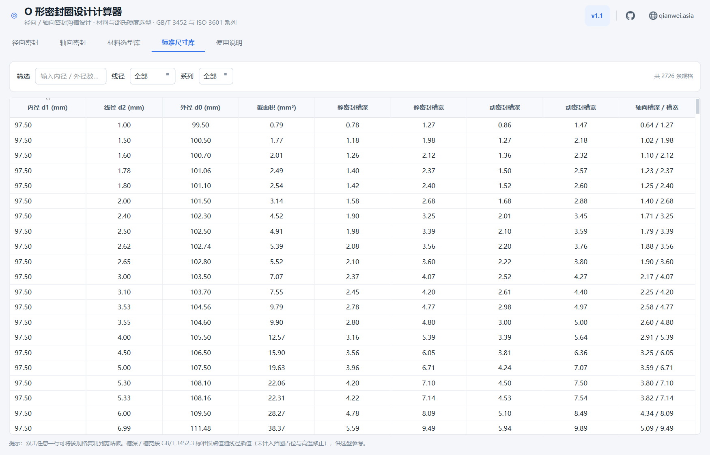
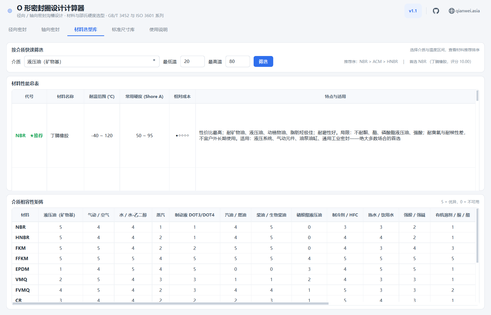

# O 形密封圈设计计算器（OringDesigner）

面向液压 / 气动 / 水密封设计的 Windows 桌面工具。输入密封面尺寸与工况，
自动完成 **O 形橡胶密封圈选型 + 沟槽设计 + 材料与硬度选型 + 装配校核**，
并给出可直接落图的沟槽尺寸与公差。

> 免责声明：程序按公开标准整理的是**工程通用取值**，适用于方案比选与初步设计。
> 高压、高温、强腐蚀或安全强制要求的场合，投产前请以最新版标准原文、
> 供应商实测数据与实际工况验证结果复核。

---

## 一、功能

### 两个模块，三种密封型式

| 模块 | 型式 | 「密封面直径」填什么 | 密封发生位置 |
|---|---|---|---|
| 径向密封 | 活塞密封 | 缸孔（缸筒内壁）直径 D | O 圈外径压向缸孔壁 |
| 径向密封 | 活塞杆密封 | 活塞杆外径 d | O 圈内径压向杆的外圆 |
| 轴向密封 | 端面 / 法兰密封 | 沟槽中心直径 dm | 两个法兰平面夹紧 O 圈 |

只需填一个密封面直径，其余全部自动解算。

### 输出内容

| 类别 | 项目 |
|---|---|
| 密封圈 | 内径 d1 ± 公差、线径 d2 ± 公差、外径 d0、截面积、拉伸率 δ |
| 沟槽 | 槽深 h、槽宽 b（含挡圈占位与高温修正）、槽底径 d3 / D3、沟槽内径 d4、外径 d5 |
| 校核 | 压缩量 c、压缩率 ε、填充率 K、装配后干涉量、允许挤出间隙、挡圈判定 |
| 装配 | 安装圆角 r₁ / r₂、导入倒角角度 θ、最小导角长度 Zmin、表面粗糙度 Ra |
| 壳体 | 壳体材料热膨胀失配引起的高温漂移 Δε、塑料蠕变补偿、超压变形提示 |
| 加工 | 槽深槽宽公差、槽底径 h9 / 外径 H9、槽口圆角 R、粗糙度要求 |
| 选型 | 材料排序（12 种材料 × 18 种介质相容性矩阵）、邵氏 A 硬度及依据 |

### 三样顺手的东西

- **沟槽剖面示意图** —— QPainter 实时绘制，自动标注全部尺寸。
- **常用工况预设** —— 真空微压 / 气动 / 水深 / 液压公称压力（GB/T 2346）/ 民用管路
  / IPX7 / IPX8 浸水，共 29 项。选中即带入压力、介质、运动方式与温度，
  压力值随后仍可手动修改。水深按静水压 `p = ρgh` 换算（1 m 水柱 ≈ 0.0098 MPa）；
  **水深只决定压力，不决定运动方式**——水下执行机构选「往复」，浸水壳体选「静态」，IPX 预设已固定为静态。
- **标准尺寸库** —— 26 种线径 × 标准内径系列，2700+ 条规格，可按内径 / 线径 / 系列筛选，
  双击复制；**一键导出 HTML / TXT 设计报告**。

### 参数处处可覆盖

界面上除「密封面直径」外都有自动推荐值，也都可以手工覆盖，输入框下方会同时
显示自动推荐值便于对比：

- **线径** —— 26 种常用规格（GB/T 3452.1 公制优先数系、AS568 / ISO 3601-1 英制折算、
  常见通用商用品径），也可直接输入任意数值（0.8 ~ 15 mm）
- **槽宽** —— 留空由标准锚点表按线径插值推荐；填写即覆盖
- **工作压力** —— 可填任意值，也可从常用工况预设一键带入
- **压缩率 / 邵氏硬度 / 材料 / 内径拉伸率** —— 均可手工指定
- **挡圈** —— 自动判定 / 不加挡圈 / 单侧挡圈 / 两侧各一个，会联动槽宽推荐值

---

## 二、下载使用

**免安装**：从本仓库的
[Releases](https://github.com/qianweighost/OringDesigner/releases) 页面下载
**`OringDesigner-v1.2.exe`**（约 34 MB，Windows 10/11 64 位），双击即用，
首次启动解压运行时约 3 ~ 5 秒。

也可以直接取仓库里的
[`dist/O型密封圈设计计算器.exe`](dist/O型密封圈设计计算器.exe)，与最新 Release 是同一产物。

> Release 附件用英文名是因为 GitHub 会丢弃附件名中的非 ASCII 字符 ——
> 用中文名 `O型密封圈设计计算器.exe` 上传会被压缩成 `O.exe`。

---

## 三、界面

| 径向密封 | 轴向密封 |
|---|---|
|  |  |

| 标准尺寸库 | 材料与硬度选型 |
|---|---|
|  |  |

---

## 四、从源码运行

```bash
pip install -r requirements.txt
python app.py
```

要求 Python 3.10+（开发环境为 3.13）与 PySide6-Essentials。

## 五、自检与打包

```bash
python tools/selftest.py      # 跑典型工况 + 生成各页签截图与示例报告 -> tools/out/
python tools/make_icon.py     # 重新生成 app.ico（与运行时窗口图标同一套画法）
build.bat                     # 生成 app.ico 并打包单文件 exe -> dist/
python tools/smoke_exe.py     # 对 dist/ 里的 exe 做启动存活冒烟测试
```

`tools/selftest.py` 会离屏渲染全部页签、跑典型工况、逐值核对 GB/T 3452.3-2005 附录 A
压缩率表、验证水深 / IPX 预设联动、壳体材料热漂移与蠕变补偿、圆角倒角取值、
线径手工输入、槽宽覆盖与挡圈档位，并导出示例报告，输出汇总在
`tools/out/selftest.txt`。

`tools/smoke_exe.py` 真启动一次打包产物并确认进程活过冷启动 ——
PyInstaller 打包「成功」不等于「能起来」，缺 DLL / 缺插件时会静默退出。

## 六、目录结构

```
OringDesigner/
├─ app.py                 程序入口、页眉、窗口图标
├─ core/
│  └─ oring_core.py       计算内核（纯 Python，零第三方依赖，可单独 import）
├─ ui/
│  ├─ theme.py            浅色工程风样式表
│  ├─ pages.py            设计计算页 / 标准尺寸库 / 材料选型库 / 使用说明
│  ├─ diagram.py          沟槽剖面示意图
│  └─ icons.py            内联 SVG 图标（GitHub / 地球）与程序图标
├─ tools/
│  ├─ make_icon.py        生成 app.ico
│  └─ selftest.py         离屏自检 + 截图
├─ dist/                  打包好的 exe
└─ build.bat              一键打包
```

计算内核 `core/oring_core.py` 不依赖界面，可直接调用：

```python
from core.oring_core import design, water_depth_pressure

r = design(mode="radial_piston",                 # 活塞密封
           surface_dia=40.0,                     # 缸孔 φ40
           pressure=water_depth_pressure(30),    # 30 m 水深
           t_low=5, t_high=40,
           medium="水 / 水-乙二醇", motion="往复")
print(r["oring"]["d1"], r["groove"]["h"], r["groove"]["b"])
```

---

## 七、标准依据

| 标准 / 手册 | 用在哪 |
|---|---|
| GB/T 3452.1 | O 形圈尺寸系列（内径、线径）及公差 |
| GB/T 3452.3 | 沟槽尺寸（槽深、槽宽）、槽口圆角与导入角 |
| GB/T 531.1 | 邵氏 A 硬度 |
| GB/T 2346 | 液压气动公称压力系列（压力预设） |
| ISO 3601 / SAE AS568 | 国际与美制尺寸系列、英制沟槽宽度 |
| Parker O-Ring Handbook / 机械设计手册 | 挤出间隙表、材料相容性 |

### 计算要点

- **压缩率（v1.2 重做）** —— 不再用一个固定的百分比区间，而是按
  **GB/T 3452.3-2005 附录 A 原表**，以线径 d₂ 为变量分四类取值：

  | 类型 | 标准出处 | d₂=1.80 | d₂=2.65 | d₂=3.55 | d₂=5.30 | d₂=7.00 |
  |---|---|---|---|---|---|---|
  | 液压往复动密封 | 图 A.1 | 13.0~28.5 | 11.5~24.0 | 9.5~23.0 | 9.0~20.5 | 9.0~19.5 |
  | 气动往复动密封 | 图 A.2 | 9.5~25.5 | 8.5~22.0 | 6.5~20.0 | 5.5~17.0 | 5.0~15.5 |
  | 径向静密封 | 图 A.3 | 13.5~30.5 | 13.0~28.0 | 11.5~27.5 | 11.0~26.0 | 10.5~24.0 |
  | 轴向静密封 | 图 A.4 | 22.5~34.5 | 21.0~30.0 | 19.0~26.0 | 16.0~24.0 | 15.0~21.0 |

  中间线径线性插值；超出 1.80 ~ 7.00 mm 时按最近档取值并提示。回转动密封取动密封下沿。
  **IPX7 / IPX8 属浸水静态密封**，归入径向静密封一类——例如 IPX8（10 m 水深、径向静密封、
  d₂=3.55）算得压缩率约 **19.9%**，落在 11.5~27.5% 区间内；
  旧版固定推荐的 10%~20% 无法覆盖 IPX8 工况，这正是 v1.2 改版的原因。
- **壳体材料（v1.2 新增）** —— 10 种常见壳体材料（碳钢 / 不锈钢 / 铝 / 黄铜 / 铸件 +
  ABS / PC / POM / PA / PP），各带线膨胀系数 α、弹性模量、建议 Ra 与承压上限。
  高温下橡胶与壳体的膨胀差按下式折算成压缩率漂移：

  ```
  Δε ≈ ΔT · (α_rubber − α_housing) · 100 %
  ```

  塑料壳体另计 **蠕变补偿 +1.5 个百分点**（POM / PA / PP 长期受压会持续变形，
  需要在装配时多压一点），并根据压力与材料承压上限给出超压变形警告。
- **槽宽** —— 由 GB/T 3452.3 与 AS568 的标准锚点值（1.80 / 2.65 / 3.55 / 5.30 / 7.00 mm）
  随线径插值；超过 7 mm 按末段斜率外推。工作温度 > 100 ℃ 时按温升放宽容槽 1%~5%；
  需要挡圈时按线径档位再占 1.40 ~ 2.80 mm 槽宽（d₂ ≤ 3.55 取 1.40，5.30 取 1.90，7.00 取 2.80）。
- **安装圆角与导入倒角（v1.2 新增）** —— 按 GB/T 3452.3 表 1 给出：
  槽底圆角 **r₁ = 0.20 ~ 0.40 mm**（d₂ ≤ 2.65）/ **0.40 ~ 0.80 mm**（3.55 ~ 5.30）/
  **0.80 ~ 1.20 mm**（≥ 7.00），槽口圆角 **r₂ = 0.10 ~ 0.30 mm**，
  导入倒角角 **θ = 15° ~ 30°（推荐 20°）**，
  最小导角长度 **Zmin = 1.10 / 1.50 / 1.80 / 2.70 / 3.60 mm**（按线径档位，标准表 1 明列）。
  另给出槽底 / 槽壁粗糙度要求（静密封 Ra ≤ 0.8 μm，动密封 Ra ≤ 0.4 μm）。
  非标线径会明确标注「标准表内 = 否」。
- **挡圈** —— 压力 > 10 MPa 或设计间隙超出允许挤出间隙时提示配置；往复 / 回转按
  双作用两侧各一个计。带挡圈时填充率校核下限由 60% 放宽到 45%。
- **拉伸率** —— 径向取 1%~5%，轴向按「自由中径 = 内径 + 线径」与沟槽中心直径对齐校核。

### 版本

| 版本 | 变更 |
|---|---|
| **v1.2** | 压缩率改为 GB/T 3452.3-2005 附录 A 原表（按线径分四类，解决 IPX8 无法覆盖的问题）；沟槽尺寸表更新到 2005 版；新增壳体材料（10 种）热漂移与蠕变补偿、超压提示；新增安装圆角 r₁/r₂、导入倒角 θ 与最小导角长度 Zmin；工况预设 26 → 29 项（含 IPX7 / IPX8）；水深预设与运动方式解耦 |
| v1.1 | 工况预设 26 项（含水深换算）、槽宽自动推荐、线径扩到 26 种可手填、页眉 GitHub / 个人网站图标、任务栏图标修复 |
| v1.0 | 首个版本：径向 / 轴向密封沟槽计算、材料选型、标准尺寸库、报告导出 |

---

## 作者

- qianweighost · [GitHub](https://github.com/qianweighost) · [www.qianwei.asia](https://www.qianwei.asia)
- 许可：[MIT](LICENSE)
